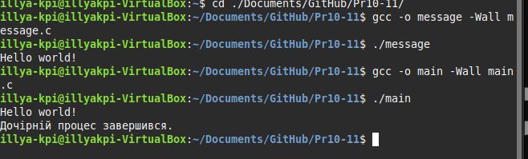

# Практична робота 10-11

## Завдання 1

### Опис

Варіант 14
Реалізуйте дві програми: одна (message) просто виводить повідомлення, інша (main) створює дочірній процес за допомогою fork(), а потім у дочірньому процесі викликає message через exec(). Батьківський процес чекає завершення дочірнього та повідомляє про це.

### Як працює

Програма main.c спочатку викликає fork(). У дочірньому процесі за допомогою execl() запускається окрема програма message, яка виводить "Hello world!". Якщо exec не вдається - виводиться повідомлення про помилку. Батьківський процес чекає завершення дочірнього через wait() і повідомляє, що дочірній процес завершився. Таким чином, демонструється створення процесу та заміна його коду на іншу програму.

### [Код до повідомлення](message.c)
### [Код до завдання](main.c)

### Результат роботи

На екрані спочатку з'являється "Hello world!" (від message), а потім повідомлення "Дочірній процес завершився." (від main).

