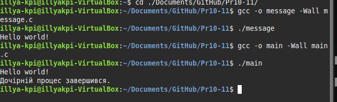

# Практична робота 10-11

## Завдання 3

**Опис:**
Напишіть програму, яка демонструє використання системного виклику `fork()` для створення нового процесу. Програма повинна виводити повідомлення про те, чи є вона батьківським чи дочірнім процесом.

**Як працює:**
При запуску програма виконує `fork()`, що створює копію поточного процесу. Якщо виклик успішний:

* У **дочірньому процесі** виконується гілка з `pid == 0`, де виводиться: `"This is the child process"`.
* У **батьківському процесі** виконується гілка з `pid > 0`, де виводиться: `"This is the parent process"`.

У випадку помилки `fork()` повертає `-1`, і виводиться повідомлення про помилку.

* [Код до завдання](task3/main.c)
* 

### Результат роботи

Після запуску програми обидва процеси — батьківський і дочірній — виводять свої повідомлення незалежно, демонструючи паралельність та незалежність після виклику `fork()`. Порядок виводу залежить від планувальника ОС і може змінюватися при кожному запуску.

---

## Завдання 4

**Опис:**
Напишіть програму, яка створює два паралельно працюючі процеси (батьківський та дочірній), і кожен з них у циклі виводить своє ім’я (Parent/Child) та номер ітерації.

**Як працює:**
Після виклику `fork()` утворюється дочірній процес. Обидва процеси виконують окремі цикли з `printf()` та `sleep(1)`, що дозволяє:

* Побачити незалежність виконання.

* Наглядно продемонструвати паралельність (рядки можуть перемішуватись залежно від планувальника ОС).

* [Код до завдання](task4/main.c)

* 

### Результат роботи

На екрані з’являється чергування повідомлень від батьківського й дочірнього процесів:

```
Parent: 0
Child: 0
Parent: 1
Child: 1
...
```

Порядок рядків **може змінюватися** при кожному запуску, оскільки процеси виконуються незалежно. Це імітує реальну багатозадачність у системі.

---

Ось виконання завдання **5.** та відповідний Markdown-опис:

---

## Завдання 5

**Опис:**
Продемонструйте, що після виклику `fork()` змінні процесів не розділяються. Дочірній і батьківський процеси мають **власні копії** пам’яті, тому зміни в одному не впливають на інший.

**Як працює:**

* Змінна `counter` ініціалізується як `0` **до** виклику `fork()`.
* У **дочірньому процесі** `counter++`, тому вона стає `1`.
* У **батьківському процесі** значення залишилось `0`, оскільки він має свою копію `counter`.

Це демонструє механізм **copy-on-write**: пам’ять копіюється лише при модифікації, і кожен процес працює з власною версією змінної.

* [Код до завдання](task5/main.c)
* 

### Результат роботи

Вивід виглядає приблизно так:

```
Child: counter = 1
Parent: counter = 0
```

Це підтверджує, що зміна значення `counter` в одному процесі **не впливає** на інший.

---

## Завдання 6

**Опис:**
Напишіть програму, яка відкриває файл перед викликом `fork()` і записує в нього з обох процесів — батьківського та дочірнього. Перевірте, як поводиться файловий дескриптор після `fork()`.

**Як працює:**

* Файл `test.txt` відкривається один раз **до виклику fork()**.
* Обидва процеси **успадковують** той самий файловий дескриптор.
* Оскільки дескриптор вказує на **одну й ту саму позицію у файлі**, записи можуть *накладатися* або *перемішуватись*, залежно від планувальника процесів.

---

### 🏴‍☠️ Пояснення прапорців `open()`

```c
open("test.txt", O_CREAT | O_WRONLY | O_TRUNC, 0644);
```

| Прапорець  | Опис                                                           |
| ---------- | -------------------------------------------------------------- |
| `O_CREAT`  | Створити файл, якщо він не існує.                              |
| `O_WRONLY` | Відкриває файл лише для запису.                                |
| `O_TRUNC`  | Якщо файл вже існує — **очищає його** (обрізає до нуля).       |
| `0644`     | Права доступу: власник може читати/писати; інші — лише читати. |

> ✳️ Увага: якщо `fork()` створює кілька процесів, які записують у той самий файл, без синхронізації, виникає **змагання за ресурси** — race condition.

---

* [Код до завдання](task6/main.c)
* 

---

### Результат роботи

Файл `test.txt` після виконання може містити:

```
Parent
Child
```

або

```
Child
Parent
```

або навіть пошкоджений змішаний вивід на зразок:

```
ParChildent
```

Все залежить від того, який процес першим отримає доступ до запису. Це демонструє, що **позиція у файлі спільна**, і для надійного запису в багатопроцесних програмах потрібна **синхронізація (наприклад, за допомогою `flock()`, `mutex`, або окремих дескрипторів)**.

---

## Завдання 7-8

**Опис:**
Реалізуйте найпростішу командну оболонку — *DumbSH*, яка зчитує команди від користувача, створює процес через `fork()`, виконує команду за допомогою `execlp()` і очікує завершення дочірнього процесу за допомогою `wait()`.

**Як працює:**

1. Користувач вводить команду в інтерфейсі `dumbsh>`.
2. Програма викликає `fork()` для створення нового процесу.
3. Дочірній процес виконує введену команду через `execlp()`.
4. Батьківський процес очікує завершення дочірнього.
5. Команда `exit` завершує оболонку.

---

### ⚙️ Особливості:

* `fgets()` зчитує рядок з `stdin`.
* `strcspn(line, "\n")` — прибирає `\n` із кінця рядка, інакше `execlp()` не знайде команду.
* `execlp()` шукає команду в \$PATH.
* `wait(NULL)` запобігає появі зомбі-процесів.

---

* [Код до завдання](task7/main.c)
* 

---

### Результат роботи

gcc dumbsh.c -o dumbsh
./dumbsh
dumbsh> ls
dumbsh> whoami
dumbsh> exit


Програма дозволяє виконувати будь-які системні команди, як у звичайній shell. Вона не підтримує аргументи до команд або конвеєри (`|`), але добре ілюструє базовий принцип роботи оболонки на основі `fork()` та `exec()`.


---

## Завдання 9

**Опис:**
Дослідіть роботу системного виклику `wait()` та макросів для перевірки завершення дочірнього процесу. Програма створює дочірній процес, який завершується з певним кодом, а батьківський чекає на нього і обробляє статус.

**Як працює:**

* Створюється дочірній процес через `fork()`.
* Дочірній процес виконує `sleep()` і завершується з кодом `42`.
* Батьківський викликає `wait(&status)`.
* За допомогою `WIFEXITED(status)` перевіряється, чи завершився процес нормально.
* `WEXITSTATUS(status)` витягує код завершення.

---

### ⚙️ Ключові API-макроси:

* `wait(&status)` — очікує будь-який дочірній процес.
* `waitpid(pid, &status, 0)` — очікує конкретного процеса за PID.
* `waitpid(pid, &status, WNOHANG)` — **не блокує**, якщо дочірній ще не завершився.
* `WIFEXITED(status)` — перевіряє, чи завершився нормально.
* `WEXITSTATUS(status)` — отримує код завершення, якщо процес завершився нормально.

---

* [Код до завдання](task9/main.c)
* 

---

### Результат роботи:

```
Child is running...
Child exited with code 42
```

Це показує, як обробляти завершення процесів у багатопроцесних програмах, щоб уникати зомбі та отримувати результат виконання дочірніх задач.


---

## Завдання 10-11

**Опис:**

* **Fork Bomb** — це шкідлива конструкція, що рекурсивно породжує безліч процесів і швидко вичерпує ресурси системи.
  Приклад (не запускати!):

  ```bash
  :(){ :|:& };:
  ```
* Програма демонструє безпечний приклад створення кількох дочірніх процесів у циклі через `fork()`, кожен із яких виводить свій індекс і завершується.
* Батьківський процес очікує на завершення всіх дітей через цикл з `wait()`.

---

### ⚙️ Особливості:

* Кількість створених дочірніх процесів обмежена (`i < 3`).
* Кожен дитячий процес виводить своє повідомлення і завершується.
* Цикл `while (wait(NULL) > 0);` гарантує, що батько дочекається завершення всіх дітей, уникаючи зомбі.

---

* [Код до завдання](task10/main.c)
* 

---

### Результат роботи:

```
Child 0
Child 1
Child 2
```

Програма створює три дочірні процеси, кожен виводить свій номер, а батьківський чекає, доки всі завершаться. Це демонструє безпечний контроль над процесами без ризику вичерпання ресурсів, на відміну від fork bomb.

wait(NULL); // будь-який дочірній
waitpid(-1, &status, 0); // еквівалент wait
waitpid(pid, &status, 0); // конкретний процес
waitpid(pid, &status, WNOHANG); // не блокує


---

## Завдання 14

### Опис

Варіант 14
Реалізуйте дві програми: одна (message) просто виводить повідомлення, інша (main) створює дочірній процес за допомогою fork(), а потім у дочірньому процесі викликає message через exec(). Батьківський процес чекає завершення дочірнього та повідомляє про це.

### Як працює

Програма main.c спочатку викликає fork(). У дочірньому процесі за допомогою execl() запускається окрема програма message, яка виводить "Hello world!". Якщо exec не вдається - виводиться повідомлення про помилку. Батьківський процес чекає завершення дочірнього через wait() і повідомляє, що дочірній процес завершився. Таким чином, демонструється створення процесу та заміна його коду на іншу програму.

### [Код до повідомлення](task14/message.c)
### [Код до завдання](task14/main.c)



### Результат роботи

На екрані спочатку з'являється "Hello world!" (від message), а потім повідомлення "Дочірній процес завершився." (від main).

