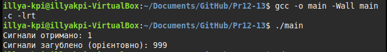

# Лабораторна робота: Обробка сигналів у Linux

## Завдання 1: Gracefully Handling Process Crashes
**Опис:** Реалізація коректної обробки аварійного завершення процесів.
**Ключові моменти:**
- Обробка сигналів: SIGSEGV, SIGFPE, SIGILL, SIGBUS
- Використання sigaction() з прапором SA_SIGINFO
- Збереження логів та очищення ресурсів

## Завдання 2: Trapping and Extracting Information from a Crash
**Опис:** Отримання додаткової інформації про помилку через siginfo_t.
**Ключові моменти:**
- Використання структури siginfo_t
- Отримання адреси помилки
- Обробка різних типів сигналів

## Завдання 3: Register Dumping
**Опис:** Отримання доступу до регістрів процесора після аварії.
**Ключові моменти:**
- Використання ucontext_t
- Доступ до регістрів архітектури
- Аналіз стану процесора

## Завдання 4: Sleeping Correctly
**Опис:** Правильна реалізація функцій очікування з урахуванням переривань.
**Ключові моменти:**
- Використання nanosleep()
- Обробка переривань
- Повторні виклики з оновленим залишком

## Завдання 5: Real-Time Signals
**Опис:** Робота з сигналами реального часу.
**Ключові моменти:**
- Буферизовані сигнали
- Передача даних через sigqueue()
- Обробка RT-сигналів

## Завдання 6: Sending Signals
**Опис:** Методи надсилання сигналів.
**Ключові моменти:**
- Використання kill()
- Надсилання через shell
- Передача додаткових даних

## Завдання 7: Publisher-Subscriber Application
**Опис:** Реалізація патерну Publisher-Subscriber на основі сигналів.
**Ключові моменти:**
- Підписник на сигнали
- Видавець сигналів
- Передача даних між процесами

## Завдання 8: Alternative Signal-Handling Techniques
**Опис:** Альтернативні методи обробки сигналів.
**Ключові моменти:**
- signalfd()
- eventfd()/epoll()
- sigwaitinfo() в потоках

## Завдання 9: sigwaitinfo and sigtimedwait
**Опис:** Синхронне очікування сигналів.
**Ключові моменти:**
- Використання sigwaitinfo()
- Блокування сигналів
- Отримання інформації про сигнал

## Завдання 10: Source Code
**Опис:** Повна реалізація Publisher-Subscriber системи.
**Ключові моменти:**
- Компіляція та запуск
- Взаємодія між процесами
- Обробка RT-сигналів

## Компіляція та запуск
Для компіляції всіх програм використовуйте:
```bash
gcc -o program_name source_file.c
```

## Залежності
- Linux OS
- GCC компілятор
- Стандартні бібліотеки C

# Практична робота 12-13

---


## 1. The Signal Mechanism in Brief

**Сигнали** — це базовий механізм міжпроцесної взаємодії (IPC) в Unix-подібних операційних системах. Вони використовуються для асинхронного сповіщення процесів про події, що сталися.

### 🔑 Ключові особливості:

* Сигнали мають **числові і символьні імена**
  (наприклад: `SIGINT` — сигнал переривання, який надсилається при натисканні `Ctrl+C`).

* Сигнали надходять **асинхронно** — у будь-який момент виконання програми.

* Кожен сигнал має **типову дію за замовчуванням**, наприклад:

  * завершення процесу (`kill`),
  * ігнорування (`ignore`),
  * зупинка (`stop`),
  * продовження (`continue`).

* Процес може **обробляти або ігнорувати** більшість сигналів, використовуючи обробники (`signal handlers`).

---

## 2. The Standard or Unix Signals

| **Назва** | **Номер** | **Опис**                                            |
| --------- | --------- | --------------------------------------------------- |
| `SIGINT`  | 2         | Переривання з клавіатури (`Ctrl+C`)                 |
| `SIGTERM` | 15        | Запит на нормальне завершення процесу               |
| `SIGKILL` | 9         | Примусове завершення (не можна перехопити)          |
| `SIGSTOP` | 19        | Зупинка процесу (також не перехоплюється)           |
| `SIGCONT` | 18        | Продовження зупиненого процесу                      |
| `SIGCHLD` | 17        | Сповіщення батька про завершення дочірнього процесу |
| `SIGSEGV` | 11        | Сегментаційна помилка (помилка доступу до пам'яті)  |

> ⚠️ **SIGKILL** і **SIGSTOP** неможливо перехопити або ігнорувати — вони завжди виконуються ядром.

---

## 3. Handling Signals

**Опис:**

Напишіть програму, яка демонструє базову обробку сигналів у Unix-подібних системах. Програма має реагувати на натискання `Ctrl+C` (сигнал `SIGINT`), не завершуючись, а виводячи повідомлення про отриманий сигнал.

**Як працює:**

* Програма встановлює обробник сигналу для `SIGINT` за допомогою функції `signal()`.
* Коли користувач натискає `Ctrl+C`, замість завершення, програма викликає функцію `handle_sigint()`, яка виводить повідомлення.
* Цикл `while(1)` забезпечує постійне виконання процесу, дозволяючи в будь-який момент перевірити реакцію на сигнал.

---

* [Код до завдання](task3_signal_handler/main.c)
* 

### Результат роботи

При натисканні `Ctrl+C` в терміналі, замість завершення, з'являється повідомлення:

```
Caught signal 2
```

Це демонструє роботу власного обробника сигналу `SIGINT`.


---

## 4. Обробка кількох сигналів

**Опис:**

Програма демонструє обробку кількох сигналів у Unix-системах — `SIGINT` (Ctrl+C) та `SIGTERM` (стандартне завершення процесу).

**Як працює:**

* При запуску виводиться PID процесу, щоб його можна було завершити вручну з іншої консолі (`kill <PID>`).
* Обробник `SIGINT` виводить повідомлення при натисканні `Ctrl+C`, але не завершує програму.
* Обробник `SIGTERM` виводить повідомлення та завершує програму через `_exit(0)`.
* Нескінченний цикл з `sleep(1)` дозволяє програмі залишатися активною, щоб приймати сигнали.

---

* [Код до завдання](task4_signal_dual/main.c)
* 
* 

### Результат роботи

1. Виводиться PID, наприклад: `PID: 12345`
2. При натисканні `Ctrl+C`:

   ```
   Caught SIGINT (Ctrl+C)
   ```
3. При виконанні `kill -TERM 12345` в іншій консолі:

   ```
   Caught SIGTERM, exiting...
   ```

Це демонструє базову, але наочну реакцію на кілька сигналів у реальному процесі.


---

## 5. Маскування сигналів

**Опис:**

Це завдання демонструє, як тимчасово заблокувати (`маскувати`) сигнал, наприклад `SIGINT`, щоб уникнути його обробки під час критичної секції коду.

**Як працює:**

* `sigset_t set` — набір сигналів, який ми будемо блокувати.
* `sigemptyset()` — очищає набір.
* `sigaddset()` — додає до набору сигнал `SIGINT`.
* `sigprocmask(SIG_BLOCK, ...)` — активує блокування сигналу.
* Після завершення критичної секції (10 секунд), `SIGINT` розблоковується через `SIG_UNBLOCK`.
* До розблокування Ctrl+C не перериває програму, після — перериває.

---

* [Код до завдання](task5_masking_signals/main.c)
* 
* 

### Результат роботи

1. Програма блокує `SIGINT` на 10 секунд.
2. Спроби натиснути `Ctrl+C` під час цього періоду не завершують програму.
3. Після повідомлення `SIGINT розблоковано`, Ctrl+C працює, як звичайно.

Це корисно, коли критична секція повинна завершитись без ризику переривання.

---

## 6. Безпечна обробка сигналів (Reentrant Safety and Signalling)

**Опис:**

Це завдання демонструє, як писати безпечні обробники сигналів, уникаючи небезпечних (не-реєнтрантних) функцій. При обробці сигналів важливо використовувати лише **асинхронно-безпечні** функції, оскільки обробник може перервати виконання програми у будь-який момент — навіть під час виконання небезпечної функції.

**Як працює:**

* Сигнал `SIGINT` (Ctrl+C) обробляється функцією `handle_sigint`.
* Замість `printf()` використовується `write()`, яка є **reentrant-safe**.
* Програма не використовує `sleep()` чи `malloc()` — лише `pause()` у основному циклі.

---

* [Код до завдання](task6_reentrant_safe/main.c)
* 

### Небезпечні функції, які НЕ можна викликати в signal handler:

| Функція    | Чому небезпечна                       |
| ---------- | ------------------------------------- |
| `printf()` | Використовує буфер, не thread-safe    |
| `malloc()` | Може бути у процесі виділення пам'яті |
| `sleep()`  | Може бути перерваний                  |
| `fork()`   | Не thread-safe у багатьох сценаріях   |
| `strtok()` | Зберігає внутрішній стан              |

### Безпечні (асинхронно-безпечні) функції:

* `_exit()`
* `write()`
* `signal()`
* `kill()`
* `getpid()`, `getppid()`
* `sigaction()` (але не у handler)

---

### Результат роботи

При натисканні `Ctrl+C`, програма не завершується, а безпечно виводить повідомлення `Received SIGINT` за допомогою `write()`. Це показує правильне використання обробників сигналів без порушення безпеки або неочікуваної поведінки.

---

Ось детальний опис прапорів `sigaction`, переписаний у Markdown-форматі для документації:

---

## 7. Прапори `sigaction` та розширене керування сигналами

**Опис:**

`sigaction()` — це розширена заміна `signal()`, яка надає гнучкіший та безпечніший спосіб обробки сигналів. Вона дозволяє налаштувати:

* сам обробник сигналу;
* **маску** сигналів, які блокуються під час обробки;
* **прапори**, що змінюють поведінку обробника.

---

### Основні прапори `sa_flags`

| Прапор         | Опис                                                                                                                                            |
| -------------- | ----------------------------------------------------------------------------------------------------------------------------------------------- |
| `SA_RESTART`   | Автоматично **повторює системні виклики**, перервані сигналом. Наприклад, `read()` чи `accept()` не повернуть `EINTR`. Зручно для стабільності. |
| `SA_SIGINFO`   | Дозволяє використовувати **розширений обробник** `sa_sigaction`, який отримує додаткову інформацію про сигнал через `siginfo_t`.                |
| `SA_NODEFER`   | **Не блокує** сигнал, який обробляється. За замовчуванням сигнал сам себе блокує під час обробки, щоб не викликати повторно.                    |
| `SA_NOCLDWAIT` | Якщо вказано з `SIGCHLD`, **не створюються зомбі-процеси**, а завершені діти автоматично знищуються.                                            |
| `SA_RESETHAND` | Після першого сигналу **повертає обробник до значення за замовчуванням** (`SIG_DFL`).                                                           |
| `SA_ONSTACK`   | Використовує **альтернативний стек**, якщо він визначений через `sigaltstack()` (для обробки сигналів у переповненому стеку).                   |


### Коли використовувати `sigaction` замість `signal`?

* Якщо потрібно керувати **масками сигналів**.
* Якщо потрібна **розширена інформація про сигнал** (через `siginfo_t`).
* Якщо ви хочете уникати проблем із перерваними системними викликами (`SA_RESTART`).
* Якщо потрібно **створити надійну багатопоточну** або критично безпечну систему.

---

> **Корисна аналогія**: `signal()` — це швидка налаштування за замовчуванням, як мікрохвильовка на 30 секунд. `sigaction()` — це повноцінна панель керування з таймером, режимами, історією — для повного контролю.

---

## 8. No Zombies — уникнення зомбі-процесів

**Опис:**

Коли **дочірній процес завершується**, а **батьківський не викликає `wait()` або `waitpid()`**, інформація про завершення дитини залишається в таблиці процесів. Такий процес називається **зомбі** (zombie process). Він займає системні ресурси, хоч і більше не виконується.

---

### Як уникнути зомбі?

Існує два основні способи:

#### 1. Обробити `SIGCHLD` з прапором `SA_NOCLDWAIT`

Це найпростіший спосіб, коли **немає потреби отримувати статус завершення дитини**.

✅ **Результат:** Дочірні процеси автоматично очищаються після завершення, не залишаючи зомбі.


#### 2. Викликати `wait()` або `waitpid()` у батьківському процесі

### Порівняння

| Підхід                 | Плюси                                  | Мінуси                           |
| ---------------------- | -------------------------------------- | -------------------------------- |
| `SA_NOCLDWAIT`         | Простота, автоматичне очищення         | Немає доступу до коду завершення |
| `wait()` / `waitpid()` | Можна дізнатись причину/код завершення | Потрібно явно викликати          |

---

> ⚠️ **Зомбі ≠ демон**. Зомбі — це залишки вже завершених процесів. Вони не виконуються, але "висять" в таблиці процесів.
> Уникати зомбі важливо в довгоживучих процесах — інакше таблиця процесів може заповнитись, і нові процеси не створяться.

---

## ✅ **Завдання 8: Уникнення зомбі-процесів (No Zombies)**

### 📋 Теорія

Коли дочірній процес завершується, він не зникає повністю з таблиці процесів, поки батьківський процес не викликає `wait()` або `waitpid()` — такий процес стає **зомбі**.

### 🧠 Вирішення:

1. **Ігнорувати сигнал `SIGCHLD` з прапором `SA_NOCLDWAIT`** — ядро одразу прибере дочірній процес.
2. **Використати `wait()` або `waitpid()`** — вручну зчитати статус завершеного дочірнього процесу.


Ось доповнений і структурований варіант пункту **9. Different Approaches to Handling Signals at High Volume**:

---

### ✅ 9. Масштабована обробка сигналів (Handling Signals at High Volume)

У системах з високою частотою подій (наприклад, десятки чи сотні `SIGUSR1` за секунду) класична модель сигналів має суттєві обмеження:

---

#### 🧨 Проблеми:

* **Сигнали не буферизуються**: якщо один тип сигналу надсилається кілька разів поспіль — буде оброблено лише один.
* **Втрати сигналів**: без черги сигналів інші екземпляри будуть **втрачені**.
* **Обмежена інформація**: стандартний сигнал не містить payload або ідентифікатора події.
* **Важко масштабувати**: звичайні обробники не підходять для систем з багатьма джерелами сигналів.

---

#### 🛠️ Підходи до масштабної обробки:

| Підхід                                             | Переваги                                                                                     | Недоліки                                             |
| -------------------------------------------------- | -------------------------------------------------------------------------------------------- | ---------------------------------------------------- |
| `signalfd()`                                       | Перетворює сигнал на дескриптор — можна обробляти через `select()`/`epoll()`.                | Linux-only, не підтримує всі типи сигналів.          |
| `sigqueue()`                                       | Дозволяє передавати дані (`union sigval`) разом із сигналом.                                 | Черга обмежена, лише один процес-отримувач.          |
| **RT-сигнали** (`SIGRTMIN`..`SIGRTMAX`)            | Чергові (queued), зберігають порядок, передають payload.                                     | Менша портативність, кількість RT-сигналів обмежена. |
| **Подієві моделі** (`epoll`/`kqueue` + `signalfd`) | Повна інтеграція сигналів у event loop, можливість неблокуючої обробки.                      | Складність реалізації, залежність від ОС.            |
| **timerfd**, `eventfd`                             | Відмова від сигналів: події реалізуються через дескриптори, які можна об'єднувати з `epoll`. | Потрібно змінити архітектуру IPC.                    |

---

#### 📌 Рекомендації:

* Використовуйте **реентрант-безпечні функції** в обробниках (`write()`, `_exit()`).
* Для складної логіки — **просто встановіть флаг** у обробнику, а обробіть його у `main loop`.
* Переходьте на **асинхронно-керовані дескриптори** (`signalfd`, `timerfd`, `eventfd`) замість сирих сигналів.
* Якщо потрібно **чергувати багато подій** — **RT-сигнали або `sigqueue()`** кращі за `kill()`.

---

#### ⚠️ Висновок:

> Сигнали — потужний, але *низькорівневий* механізм. Вони ідеальні для **простих подій**, але **непередбачувані** в складних чи масових сценаріях.
> У сучасних системах їх часто **замінюють на більш стабільні механізми IPC** — черги повідомлень, сокети, пайпи, подієві дескриптори.

---

Хочеш — перетворю в markdown з кодом прикладів `signalfd`, `sigqueue`, або `SIGRTMIN`.

### ✅ Підсумок:

* Завдання 8 — про **управління життєвим циклом дочірніх процесів** (зомбі).
* Завдання 9 — про **масштабовану обробку сигналів** при великій кількості подій.


---

## ✅ 10. Gracefully Handling Process Crashes

### 🧠 Теорія

Фатальні сигнали (`SIGSEGV`, `SIGFPE`, `SIGILL`, `SIGBUS`) за замовчуванням викликають аварійне завершення процесу з core dump'ом. Проте іноді краще не падати миттєво, а:

* **записати лог чи повідомлення в stderr**
* **закрити дескриптори**, почистити тимчасові файли
* **повідомити сервер моніторингу або надіслати метрики**
* **завершити процес контрольовано**, без core dump

Для цього використовують `sigaction()` із простим обробником (`sa_handler`), який виконує базові дії і викликає `_exit()`.

> ⚠️ У сигнал-обробнику дозволено лише **async-signal-safe** функції (наприклад, `write()`, `_exit()`). Використовувати `malloc()`, `printf()`, `exit()` — **небезпечно!**

---

## ✅ 11. Trapping and Extracting Information from a Crash

### 🧠 Теорія

Для складнішого аналізу варто отримати **додаткову інформацію про сигнал** — наприклад:

* **Адреса, де сталася помилка** (`si_addr`)
* **Код причини** (`si_code`) — наприклад, `SEGV_MAPERR` (невідображена сторінка) або `SEGV_ACCERR` (порушення доступу)
* **Регістри, стек** (через `ucontext_t`)

Це можливо лише через `sigaction()` з прапором `SA_SIGINFO` та вказанням `sa_sigaction` замість `sa_handler`.


---

## 🔎 Порівняння підходів:

| Підхід                   | Простий (`sa_handler`)     | Розширений (`sa_sigaction`)  |
| ------------------------ | -------------------------- | ---------------------------- |
| Використання             | Легка очистка, завершення  | Діагностика, логування крашу |
| Доступ до адреси помилки | ❌                          | ✅                            |
| Безпечність              | ✅ (якщо тільки async-safe) | ⚠️ Потрібно обережно         |
| Підтримка backtrace      | ❌                          | ✅ (через `ucontext`)         |

---

Якщо хочеш — можу додати приклад з `backtrace()`, дамп регістрів з `ucontext_t`, або навіть відновлення після крашу через `sigsetjmp`/`siglongjmp`.

---

Ось два завдання — **12 та 13**, з чітко поділеною теорією та кодами:

---

## ✅ 12. Register Dumping (Зняття дампу регістрів після краху)

### 🧠 Теорія

При обробці фатального сигналу (напр., `SIGSEGV`) можна отримати доступ до **вмісту регістрів CPU** на момент аварії. Це особливо корисно для:

* налагодження низькорівневих помилок;
* створення власного механізму міні-dump'у;
* розуміння, де саме сталася помилка (наприклад, адреса інструкції в `RIP` або `EIP`).

Це можливо через третій параметр обробника сигналу (`ucontext_t *context`), який передається при `SA_SIGINFO`.

> ⚠️ Формат `ucontext_t` і макроси доступу до регістрів залежать від архітектури: x86\_64, x86, ARM тощо.
	
---

## ✅ 13. Sleeping Correctly (Правильна реалізація сну з обробкою сигналів)

### 🧠 Теорія

Функції сну (`sleep()`, `usleep()`, `nanosleep()`) можуть бути **перервані сигналами** (наприклад, `SIGCHLD`, `SIGALRM`).

Результат:

* час очікування може бути коротшим, ніж потрібно;
* `nanosleep()` повертає `-1`, а `errno == EINTR`.

**Рішення**:

1. **Повторно викликати `nanosleep()` з оновленим залишком** часу:

   * `nanosleep(&req, &rem)` — `rem` містить залишок часу після переривання.
2. **Альтернатива** — `sigsuspend()` або `clock_nanosleep(CLOCK_MONOTONIC, 0, &ts, NULL)` для більшої точності.


## 🧠 Підсумок:

| Завдання     | 12. Register Dumping                     | 13. Sleeping Correctly                          |
| ------------ | ---------------------------------------- | ----------------------------------------------- |
| Проблема     | Як дізнатись, що саме “впало” в процесі  | Як не втратити час очікування при сигналі       |
| Рішення      | Аналіз `ucontext_t` в обробнику сигналу  | Повторне викликання `nanosleep()`               |
| Актуальність | Низькорівневе дебагування, аналіз крашів | Правильне очікування у сигналізованих програмах |

Можу доповнити ці приклади інтеграцією з логером, або розширеним дампом регістрів і стеку.

---

Ось завдання **14** і **15** з теоретичною частиною та прикладами коду:

---

## ✅ 14. Real-Time Signals (Реальновчасні сигнали)

### 🧠 Теорія

**Real-Time сигнали** — це розширення класичної сигналізації в POSIX, що мають низку важливих переваг:

* **Буферизація**: сигнали *не губляться*, якщо кілька однакових сигналів надіслано підряд.
* **Передача даних**: через `sigqueue()` можна передати значення типу `union sigval`.
* **Пріоритезація**: RT-сигнали мають номери від `SIGRTMIN` до `SIGRTMAX` і доставляються в порядку надсилання (на відміну від звичайних).

> ⚠️ Кількість доступних RT-сигналів і глибина черги — залежать від системи (`/proc/sys/kernel/rtsig-max`, `ulimit -r`).

---

## ✅ 15. Sending Signals (Надсилання сигналів)

### 🧠 Теорія

Сигнали можна надсилати **з коду** або **через shell**:

* **Shell**:

  * `kill -SIGTERM <pid>`
  * `kill -SIGUSR1 <pid>`
* **C API**:

  * `kill(pid, signal)` — класична функція надсилання сигналу.
  * `sigqueue(pid, signal, val)` — дозволяє передавати додаткові дані (`val`).

> ⚠️ Пам'ятайте: щоб надіслати сигнал іншому процесу, потрібні відповідні **права доступу** (звичайно — один UID).

---


## 🧠 Підсумок

| Завдання     | 14. Real-Time Signals                      | 15. Sending Signals                          |
| ------------ | ------------------------------------------ | -------------------------------------------- |
| Ключова ідея | Надсилання сигналів з даними, черговість   | Як програмно (або з shell) надсилати сигнали |
| API          | `sigqueue()`, `sigaction()`                | `kill()`, `sigqueue()`                       |
| Проблеми     | Системні обмеження на черги, delivery time | Недостатньо прав, PID неіснує                |

Можу також зробити приклад використання RT-сигналів з `sigtimedwait()` або `signalfd()` для event-based підходу.


---

Окей, Ілля, розбиваємо на два чисті, але пов’язані приклади — у форматі publisher-subscriber з RT-сигналами. Плюс доповнюємо теорією по альтернативним способам обробки сигналів.

---

# 16. A Small Publisher-Subscriber Type of Application


### Теорія

* **RT-сигнали** (`SIGRTMIN`–`SIGRTMAX`) підтримують черговість і не втрачаються при надсиланні.
* `sigqueue()` дозволяє передати сигнал разом із додатковими даними (`union sigval`).
* Обробник із `SA_SIGINFO` отримує ці дані у `siginfo_t->si_value`.
* Publisher надсилає сигнал конкретному процесу за PID.
* Subscriber очікує сигнал і обробляє його асинхронно.

---

# 17. Alternative Signal-Handling Techniques

### Чому іноді замість `signal()`/`sigaction()`?

* Сигнали — асинхронні, з обмеженнями reentrancy.
* Складно комбінувати із сучасними event-loop (epoll/kqueue).
* Висока ймовірність втрати сигналів при великих навантаженнях.

---

### Основні альтернативи

| Метод                       | Опис                                              | Плюси                                 | Мінуси                         |
| --------------------------- | ------------------------------------------------- | ------------------------------------- | ------------------------------ |
| **signalfd()**              | Linux-специфічний, сигнал перетворюється у fd     | Інтеграція з epoll, можна select/poll | Портативність обмежена Linux   |
| **eventfd() + epoll()**     | Створення дескрипторів подій, що можна моніторити | Відмінно для event-loop               | Не спеціалізовано для сигналів |
| **Threads + sigwaitinfo()** | Синхронне очікування сигналів у потоці            | Безпечний, блокуючий, без async       | Додатковий потік, складність   |

---

### Коротка ідея використання `signalfd()` (приклад без коду)

* Створюємо fd для потрібних сигналів (`signalfd`).
* Моніторимо цей fd через `epoll` або `poll`.
* При настанні сигналу читаємо інформацію, як з файлу — синхронно, без асинхронного інтеррапту.

---

Ось розбиття на два завдання з теорією, плюс повний код і пояснення.

---

## 18. The sigwaitinfo and the sigtimedwait System Calls

### Теорія

`s`igwaitinfo і `sigtimedwait` — це синхронні системні виклики, що дозволяють процесу чекати на сигнал, блокуючи виконання, а не отримувати його асинхронно через обробники.

* **Переваги:**

  * Відсутність асинхронних callback-ів — простіше працювати з ресурсами, бо не треба турбуватися про reentrancy.
  * Отримання детальної інформації про сигнал через `siginfo_t`.
  * `sigtimedwait` дозволяє задати таймаут очікування.
* Застосування:

  * Синхронна обробка сигналів у потоках.
  * Логіка, де потрібно «витягнути» сигнал у визначений момент.

---

## 10. Source Code (Збірка компонентів)

### subscriber.c (підписник)

### publisher.c (видавець)

```c
#include <signal.h>
#include <stdlib.h>
#include <unistd.h>

int main(int argc, char *argv[]) {
    if (argc < 2) return 1;

    pid_t pid = atoi(argv[1]);
    union sigval val;
    val.sival_int = 99;

    if (sigqueue(pid, SIGRTMIN, val) == -1) {
        perror("sigqueue");
        return 1;
    }
}
```

---

### Компіляція

```bash
gcc subscriber.c -o subscriber
gcc publisher.c -o publisher
```

---

### Короткий опис:

* `subscriber` підписується на RT-сигнали `SIGRTMIN` та виводить отримані значення.
* `publisher` надсилає RT-сигнал із payload у вигляді цілого числа.
* Цей код демонструє просту модель паблішер-сабскрайбер через сигнали Linux.

---

Якщо хочеш, можу допомогти з інтеграцією цих прикладів у один README або зробити кращу структуру проекту.


---

## Завдання 14last

### Опис

Варіант 14
Напишіть програму, яка створює таймер (timer_create) і надсилає реальні сигнали SIGRTMIN з дуже малою інтервальною затримкою. Програма повинна підрахувати, скільки сигналів реально оброблено, а скільки загублено за певний час роботи.

### Як працює

Встановлюється обробник сигналу SIGRTMIN через sigaction з SA_SIGINFO. Створюється таймер через timer_create, який надсилає сигнал SIGRTMIN кожну мілісекунду. У обробнику сигналу ведеться підрахунок отриманих сигналів. Після закінчення часу (наприклад, 1 секунда) таймер видаляється, і програма виводить кількість отриманих сигналів та приблизну кількість загублених (MAX_SIGNALS - отримано). Це дозволяє оцінити, скільки сигналів може бути втрачено при великій частоті надсилання.

### [Код до завдання](task14last/main.c)



### Результат роботи

Виводиться кількість отриманих сигналів та приблизна кількість загублених за час роботи таймера.
Сигнали втрачаються, бо SIGEV_SIGNAL надсилає сигнали асинхронно, а ядро Linux має обмежену чергу для них - обробник не встигає реагувати, нові сигнали замінюють старі або ігноруються, тому значна частина подій (999/1000) просто губиться.
