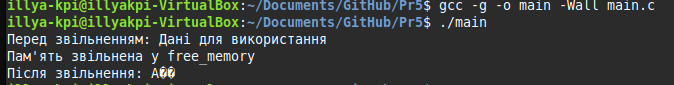

# Практична робота 12-13

## Завдання 1

### Опис

Варіант 14
Напишіть програму, яка створює таймер (timer_create) і надсилає реальні сигнали SIGRTMIN з дуже малою інтервальною затримкою. Програма повинна підрахувати, скільки сигналів реально оброблено, а скільки загублено за певний час роботи.

### Як працює

Встановлюється обробник сигналу SIGRTMIN через sigaction з SA_SIGINFO. Створюється таймер через timer_create, який надсилає сигнал SIGRTMIN кожну мілісекунду. У обробнику сигналу ведеться підрахунок отриманих сигналів. Після закінчення часу (наприклад, 1 секунда) таймер видаляється, і програма виводить кількість отриманих сигналів та приблизну кількість загублених (MAX_SIGNALS - отримано). Це дозволяє оцінити, скільки сигналів може бути втрачено при великій частоті надсилання.

### [Код до завдання](main.c)

### Результат роботи

Виводиться кількість отриманих сигналів та приблизна кількість загублених за час роботи таймера.
Сигнали втрачаються, бо SIGEV_SIGNAL надсилає сигнали асинхронно, а ядро Linux має обмежену чергу для них - обробник не встигає реагувати, нові сигнали замінюють старі або ігноруються, тому значна частина подій (999/1000) просто губиться.
