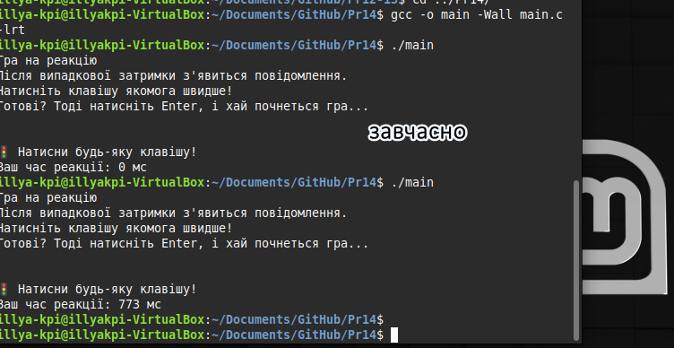

# Практична робота 14

Цей текст логічно ділиться на **6 окремих завдань**, кожне з яких охоплює окрему концепцію, інтерфейс або приклад застосування. Ось як це можна структуровано розбити:

---

Ось структурований README з розбиттям на завдання + теорію по таймерам у Unix/Linux. Все зручно в одному документі.

---

# Timers in Unix/Linux — Old and New Interfaces

---

## 1. Older Interfaces

### Теорія

У ранніх Unix системах для таймерів використовувалися прості й часто обмежені механізми:

* **`alarm()`**
  Викликає сигнал `SIGALRM` через задану кількість секунд.
  **Плюси:** дуже простий у використанні.
  **Мінуси:** лише один таймер на процес, не можна керувати деталями інтервалу.

* **`sleep()`, `usleep()`**
  Блокують процес або потік на заданий час.
  **Проблеми:** неможливо реагувати на події асинхронно.

* **`setitimer()`**
  Створює інтервальний таймер, який надсилає сигнал (наприклад, `SIGALRM`) через певні інтервали.
  **Обмеження:** всього три таймери на процес (по одному на тип сигналу), важко інтегрувати з сучасними асинхронними моделями.

---

## 2. Interval Timers (`setitimer`)

### Теорія

`setitimer()` дає змогу створити таймер з початковим відліком (`it_value`) і повторним інтервалом (`it_interval`).

Типи таймерів:

| Таймер           | Сигнал      | Опис                      |
| ---------------- | ----------- | ------------------------- |
| `ITIMER_REAL`    | `SIGALRM`   | Реальний час (wall-clock) |
| `ITIMER_VIRTUAL` | `SIGVTALRM` | Час виконання процесу     |
| `ITIMER_PROF`    | `SIGPROF`   | Час користувача + ядра    |

Можна використовувати `getitimer()` для отримання поточного стану таймера.

---

## 3. A Simple CLI Digital Clock

### Ідея

На базі `alarm()` або `setitimer()` зробити годинник у консолі, що оновлюється кожну секунду.

### Код обробника сигналу:

```c
void handler(int sig) {
    time_t now = time(NULL);
    struct tm *tm_info = localtime(&now);
    char buf[64];
    strftime(buf, sizeof(buf), "%H:%M:%S\n", tm_info);
    write(STDOUT_FILENO, buf, strlen(buf));
    alarm(1);  // Викликати наступний сигнал через 1 секунду
}
```

---

## 4. The Newer POSIX Interval Timers Mechanism

### Теорія

POSIX таймери — сучасна альтернатива `setitimer()`:

* Можна створювати **кілька** таймерів одночасно.
* Підтримка точності до наносекунд.
* Таймери можуть генерувати події у вигляді сигналів або через дескриптори (Linux-специфічно — `timerfd_create()`).
* Інтеграція з асинхронними системами, такими як `epoll`.

---

## 5. Arming, Disarming and Querying a POSIX Timer

### Теорія

* `timer_create()` — створює таймер, налаштовуючи як він спрацьовує (одноразово чи інтервально).
* `timer_settime()` — активує таймер, задаючи початковий час (`it_value`) і інтервал (`it_interval`).
* `timer_gettime()` — отримує поточний стан (залишок часу та інтервал).
* `timer_delete()` — видаляє таймер.

Таймер можна відключити, встановивши `it_value = {0, 0}`.

---

## 6. Example Program – POSIX Interval Timers

```c

```

---

### Пояснення:

* Використовуємо `SIGRTMIN` для уникнення конфліктів зі стандартними сигналами.
* Таймер з інтервалом у 1 секунду.
* Асинхронний обробник через `sa_sigaction`.
* `pause()` зупиняє процес до сигналу.

---

## Завдання 14

### Опис

Варіант 14
Створіть консольну гру на реакцію, яка вимірює час реакції користувача на появу сигналу від таймера. Після випадкової затримки програма подає сигнал, і користувач має якомога швидше натиснути клавішу. Вимірюється час між появою сигналу та натисканням клавіші.

### Як працює

Програма виводить інструкцію, чекає натискання Enter для старту. Далі створюється таймер через timer_create, який після випадкової затримки (1-5 секунд) надсилає сигнал SIGRTMIN. У обробнику сигналу фіксується час початку реакції та виводиться запрошення натиснути клавішу. Програма переводить термінал у "сирий" режим, щоб одразу зчитати натискання. Після натискання клавіші фіксується час завершення, обчислюється і виводиться час реакції у мілісекундах. Після завершення термінал повертається у звичайний режим.

### [Код до завдання](main.c)



### Результат роботи

На екрані з'являється інструкція, після сигналу користувач натискає клавішу, і програма виводить час реакції у мілісекундах.

gcc main.c -o main -lrt


