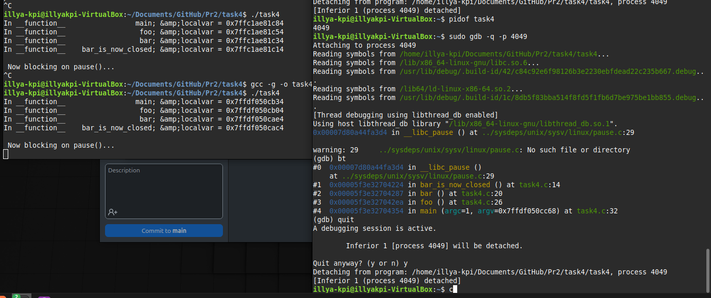

# ЗАВДАННЯ 1

## Умова

Напишіть програму для визначення моменту, коли time_t закінчиться. Дослідіть, які зміни відбуваються в залежності від 32- та 64-бітної архітектури. Дослідіть сегменти виконуваного файлу.

## [Код до завдання](task1/task1.c)

## Пояснення програми

Програма визначає максимальне значення, яке може мати змінна типу `time_t`. Це значення залежить від **архітектури системи** — 32-бітної або 64-бітної.

- **На 32-бітних системах** `time_t` зазвичай є 32-бітним цілим числом зі знаком, тому його максимальне значення — 2 147 483 647 секунд від початку епохи UNIX (1970-01-01). Це відповідає **19 січня 2038 року** — після цього значення переповнюється, що призводить до **помилок у роботі з часом**.

- **На 64-бітних системах** `time_t`, як правило, має 64 біти, що дозволяє представляти дати на мільярди років уперед.

## Результат роботи


---

# ЗАВДАННЯ 2

## Умова

Розгляньте сегменти у виконуваному файлі.

1. Скомпілюйте програму "hello world", запустіть ls -l для виконуваного файлу, щоб отримати його загальний розмір, і запустіть size, щоб отримати розміри сегментів всередині нього.

2. Додайте оголошення глобального масиву із 1000 int, перекомпілюйте й повторіть вимірювання. Зверніть увагу на відмінності.

3. Тепер додайте початкове значення в оголошення масиву (пам’ятайте, що C не змушує вас вказувати значення для кожного елемента масиву в ініціалізаторі). Це перемістить масив із сегмента BSS у сегмент даних. Повторіть вимірювання. Зверніть увагу на різницю.

4. Тепер додайте оголошення великого масиву в локальну функцію. Оголосіть другий великий локальний масив з ініціалізатором. Повторіть вимірювання. Дані розташовуються всередині функцій, залишаючись у виконуваному файлі? Яка різниця, якщо масив ініціалізований чи ні?

5. Які зміни відбуваються з розмірами файлів і сегментів, якщо ви компілюєте для налагодження? Для максимальної оптимізації?

Проаналізуйте результати, щоб переконатися, що:

● сегмент даних зберігається у виконуваному файлі;

● сегмент BSS не зберігається у виконуваному файлі (за винятком примітки щодо його вимог до розміру часу виконання);

● текстовий сегмент більшою мірою піддається перевіркам оптимізації;

● на розмір файлу a.out впливає компіляція для налагодження, але не сегменти.

---
### 1
---

## [Код до завдання](task2/task2p1.c)

## Пояснення програми

Це програма, яка демонструє розміри базового виконуваного файлу. Виконуваний файл містить тільки текстовий сегмент із кодом програми.

## Результат роботи


---
### 2
---

## [Код до завдання](task2/task2p2.c)

## Пояснення програми

Глобальний масив додається до сегмента BSS, який не зберігається у виконуваному файлі, але резервується під час виконання. Розмір виконуваного файлу незначно змінюється, однак обсяг пам’яті, необхідний для виконання програми, збільшується.

## Результат роботи


---
### 3
---

## [Код до завдання](task2/task2p3.c)

## Пояснення програми

Глобальний масив із початковим значенням переміщається з сегмента BSS до сегмента DATA. Це впливає на розмір виконуваного файлу, оскільки сегмент DATA зберігається у ньому.

## Результат роботи


---
### 4
---

## [Код до завдання](task2/task2p4.c)

## Пояснення програми

Локальні масиви створюються в стеку під час виконання програми. Масив без ініціалізації `uninizialized_array` розміщується в стеку, а масив із ініціалізацією `inizialized_array` додає додаткові дані до текстового сегмента. Виконуваний файл змінюється лише через наявність ініціалізованого масиву.

## Результат роботи


---
### 5
---

## [Код до завдання](task2/task2_4.c)

## Пояснення програми

При компіляції з налагодженням файл містить додаткову інформацію для дебагу, що збільшує його розмір. Максимальна оптимізація зменшує розмір текстового сегмента, але не впливає на сегменти DATA і BSS. Масиви в стеку залишаються лише під час виконання програми, не змінюючи розміри виконуваного файлу.

## Результат роботи


# ЗАВДАННЯ 3

## Умова

Скомпілюйте й запустіть тестову програму, щоб визначити приблизне розташування стека у вашій системі:

```c

#include <stdio.h>

  

int main() {

        int i;

        printf("The stack top is near %p\n";, &amp;i);

        return 0;

}

```

Знайдіть розташування сегментів даних і тексту, а також купи всередині сегмента даних, оголосіть змінні, які будуть поміщені в ці сегменти, і виведіть їхні адреси. Збільшіть розмір стека, викликавши функцію й оголосивши кілька великих локальних масивів. Яка зараз адреса вершини стека?

*Примітка*: стек може розташовуватися за різними адресами на різних архітектурах та різних ОС. Хоча ми говоримо про вершину стека, на більшості процесорів стек зростає вниз, до пам’яті з меншими значеннями адрес.

---
### 1
---

## [Код до завдання](task3/task3p1.c)

## Результат роботи


---
### 2
---

## [Код до завдання](task3/task3p2.c)

## Пояснення програми

Код досліджує розташування різних сегментів пам’яті. Адреса функції `func` показує текстовий сегмент (зберігає машинний код програми). Глобальна змінна `x` з ініціалізацією належить до сегмента DATA, а неініціалізована глобальна змінна `y` — до сегмента BSS. Виділення пам’яті через `malloc` демонструє розташування купи, а адреса локальної змінної `z` показує місце стека. Програма допомагає зрозуміти, як пам’ять організована і використовується різними сегментами.

## Результат роботи


---
### 3
---

## [Код до завдання](task3/task3p3.c)

## Пояснення програми

У коді досліджується, як змінюється розташування вершини стека при виділенні великих локальних масивів. На початку виводиться адреса змінної `i` у `main`, що вказує на початкове розташування стека. Після виклику функції func, де оголошені масиви `arr1` і `arr2`, адреса вершини стека зсувається вниз (у більшість архітектур стек зростає до нижчих адрес). Це ілюструє динамічний характер використання стека під час виконання програми.

## Результат роботи


# ЗАВДАННЯ 4

## Умова

Ваше завдання – дослідити стек процесу або пригадати, як це робиться. Ви можете:

● Автоматично за допомогою утиліти gstack.

● Вручну за допомогою налагоджувача GDB.

Користувачі Ubuntu можуть зіткнутися з проблемою: на момент написання (Ubuntu 18.04) gstack, схоже, не був доступний (альтернативою може бути pstack). Якщо gstack не працює, використовуйте другий метод – через GDB, як показано нижче. Спочатку подивіться на стек за допомогою gstack(1). Нижче наведений приклад стека bash (аргументом команди є PID процесу):

$ gstack 14654

# 0 0x00007f359ec7ee7a in waitpid () from /lib64/libc.so.6

# 1 0x000056474b4b41d9 in waitchild.isra ()

# 2 0x000056474b4b595d in wait_for ()

# 3 0x000056474b4a5033 in execute_command_internal ()

# 4 0x000056474b4a5c22 in execute_command ()

# 5 0x000056474b48f252 in reader_loop ()

# 6 0x000056474b48dd32 in main ()

$

Розбір стека:

    ● Номер кадру стека відображається ліворуч перед символом #.

    ● Кадр #0 – це найнижчий кадр. Читайте стек знизу вверх (тобто від main() – кадр #6 – до waitpid() – кадр #0).

    ● Якщо процес багатопотоковий, gstack покаже стек кожного потоку окремо.

Аналіз стека в режимі користувача через GDB

Щоб переглянути стек процесу вручну, використовуйте GDB, приєднавшись до процесу. Нижче наведена невелика тестова програма на C, що виконує кілька вкладених викликів функцій. Граф викликів виглядає так:

    main() --&gt; foo() --&gt; bar() --&gt; bar_is_now_closed() --&gt; pause()

Системний виклик pause() – це приклад блокуючого виклику. Він переводить викликаючий процес у сплячий режим, очікуючи (або блокуючи) сигнал. У цьому випадку процес блокується, поки не отримає будь-який сигнал.

```c

#include <stdio.h>

#include <stdlib.h>

#include <unistd.h>

#include <sys/types.h>

  

#define MSG "In function %20s; &amp;localvar = %p\n";

  

static void bar_is_now_closed(void) {

    int localvar = 5;

    printf(MSG, FUNCTION, &localvar);

    printf("\n Now blocking on pause()...\n");

  

    pause();

}

  

static void bar(void) {

    int localvar = 5;

    printf(MSG, FUNCTION, &localvar);

    bar_is_now_closed();

}

  

static void foo(void) {

    int localvar = 5;

    printf(MSG, FUNCTION, &localvar);

    bar();

}

  

int main(int argc, char **argv) {

    int localvar = 5;

    printf(MSG, FUNCTION, &localvar);

    foo();

    exit(EXIT_SUCCESS);

}

```


Тепер відкрийте GDB

У ньому підключіться (attach) до процесу (в наведеному прикладі PID = 24957) і дослідіть стек за допомогою команди backtrace (bt):

$ gdb --quiet

(gdb) attach 24957

Attaching to process 24957

Reading symbols from &lt;...&gt;/hspl/unit2/stacker...done.

Reading symbols from /lib64/libc.so.6...Reading symbols from

/usr/lib/debug/usr/lib64/libc-2.26.so.debug...done.

done.

Reading symbols from /lib64/ld-linux-x86-64.so.2...Reading symbols

...

(gdb) bt

...

Примітка: В Ubuntu, через питання безпеки, GDB не дозволяє підключатися до довільного процесу. Це можна обійти, запустивши GDB від імені користувача root.

Аналіз того ж процесу через gstack

$ gstack 24957

...

gstack — це, по суті, оболонковий скрипт (wrapper shell script), який неінтерактивно викликає GDB і запускає команду backtrace, яку ви щойно використали. Завдання: Ознайомтеся з виводом gstack і порівняйте його з GDB.

## [Код до завдання](task4/task4.c)

## Пояснення програми

Програма демонструє вкладені виклики функцій із передачею керування через `main()`, `foo()`, `bar()` та `bar_is_now_closed()` і подальше блокування на системному виклику `pause()`. Кожна функція виводить адресу своєї локальної змінної, дозволяючи відстежувати зміни в стеку. Завдання передбачає дослідження стеку процесу за допомогою інструментів procstat та GDB для порівняння їхньої функціональності.


## Результат роботи

Запуск програми:



Procstat:


GDB:


# ЗАВДАННЯ 5

## Умова

Відомо, що при виклику процедур і поверненні з них процесор використовує стек. Чи можна в такій схемі обійтися без лічильника команд (IP), використовуючи замість нього вершину стека? Обґрунтуйте свою відповідь та наведіть приклади.

## [Код до завдання](task5/task5p1.c)

## Результат роботи


---

---

## [Код до завдання](task5/task5p2.c)

## Пояснення програми

У цьому завданні досліджується, чи можна замінити лічильник команд (Instruction Pointer, IP) вершиною стека при виклику функцій та поверненні з них.

У першому коді стандартний механізм виклику функцій використовує стек для збереження адреси повернення. При завершенні функції процесор автоматично бере адресу повернення зі стека і оновлює IP для продовження виконання програми.

У другому коді використовується інструкцію `asm("addq $8, %rsp")`, яка вручну змінює вершину стека без оновлення IP. Це демонструє, що при маніпуляціях зі стеком без відповідної роботи з IP програма може поводитися непередбачувано, оскільки процесор все одно очікує використовувати IP для коректного виконання інструкцій.

Стек і IP виконують різні ролі. Стек використовується для збереження адреси повернення та локальних даних функцій. IP вказує на поточну інструкцію, яку виконує процесор. Заміна IP вершиною стека неможлива без суттєвих змін в архітектурі процесора, оскільки стек не забезпечує послідовності виконання команд.

| **Приклад** | **Особливості** | **Результат** |

|-----------------------------|-------------------------------|----------------------------------------------|

| **Базовий виклик функції** | Стандартний виклик функції зі збереженням адреси повернення в стеку. | Повернення в `main()` працює коректно, оскільки IP оновлюється автоматично. |

| **Маніпуляція зі стеком** | Використання інструкції `asm` для ручного зміщення вершини стека. | Порушення виконання програми: процесор втрачає правильну адресу повернення через некоректний IP. |

## Результат роботи


# ЗАВДАННЯ ПО ВАРІАНТАХ

# Завдання по варіантах
  
## Умова

14. Реалізуйте програму для аналізу вмісту /proc/self/maps.
1. Реалізуйте програму для аналізу вмісту /proc/self/maps.
  
## [Код до завдання](task6/task6.c)

## Пояснення програми

## Результат роботи


