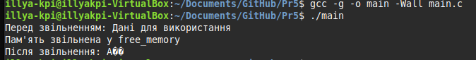

# Практична робота 5

## Завдання 1

### Опис

Побудуйте приклад "викрадення" покажчика, коли одна функція звільняє пам’ять, яка ще використовується в іншій.

### Програмна реалізація

Виділяється пам'ять, записуються дані, пам'ять звільняється у функції, після чого відбувається спроба доступу до неї (що є помилкою).

### [Код до завдання](main.c)

### Результат роботи

програма виведе рядок до звільнення пам'яті, повідомить про звільнення, а потім виводить некоректні дані (use-after-free). Це демонструє помилку доступу до звільненої пам'яті. 