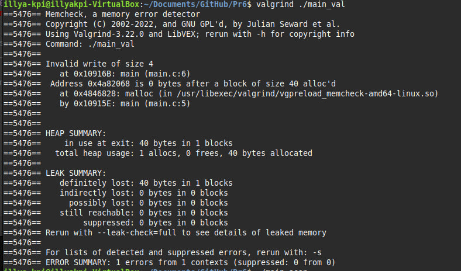

# Практична робота 6

## Завдання 1

### Опис

Демонстрація помилки використання пам'яті після її звільнення.

### Програмна реалізація

Виділяється пам'ять, звільняється, а потім відбувається спроба доступу до неї (use-after-free).

### [Код до завдання](main.c)


### Результат роботи

Програма може вивести некоректні або порожні дані після звільнення пам'яті або навіть аварійно завершитися (segmentation fault). Це демонструє помилку use-after-free.

---

## Завдання 2

### Опис

Порівняння інструментів виявлення помилок у роботі з памʼяттю: **AddressSanitizer (ASan)** та **Valgrind**.

### Програмна реалізація

Програма містить помилку виходу за межі виділеного масиву:

```c
#include <stdlib.h>

int main() {
    int *arr = malloc(10 * sizeof(int));
    arr[10] = 5; // Тут помилка
    return 0;
}
```

### Компіляція та запуск

**AddressSanitizer:**

```bash
gcc -fsanitize=address -g -o leak_asan leak.c
./leak_asan
```

**Valgrind:**

```bash
gcc -g -o leak_val leak.c
valgrind ./leak_val
```

### Результат роботи

| Інструмент | Тип помилки             | Швидкість | Повідомлення                                      |
| ---------- | ----------------------- | --------- | ------------------------------------------------- |
| ASan       | heap-buffer-overflow    | Висока    | Детальний звіт з рядком помилки                   |
| Valgrind   | invalid write of size 4 | Низька    | Менш точне, але доступне без повторної компіляції |

ASan швидше та точніше показує помилки, але потребує повторної компіляції з ключами `-fsanitize=address -g`. Valgrind працює повільніше, однак не вимагає додаткових флагів при компіляції.

---

### Вивід у консоль



