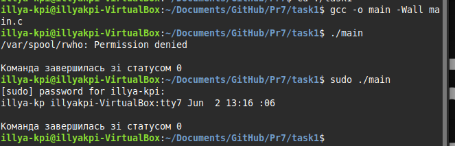
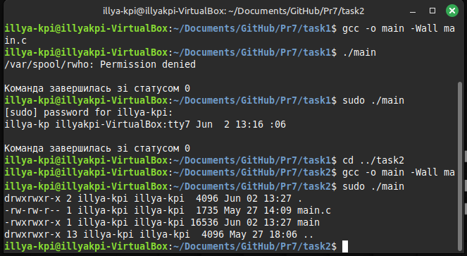
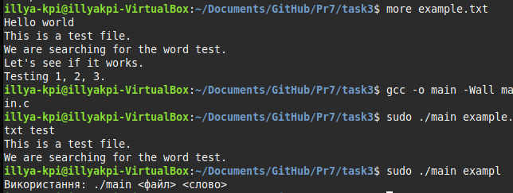
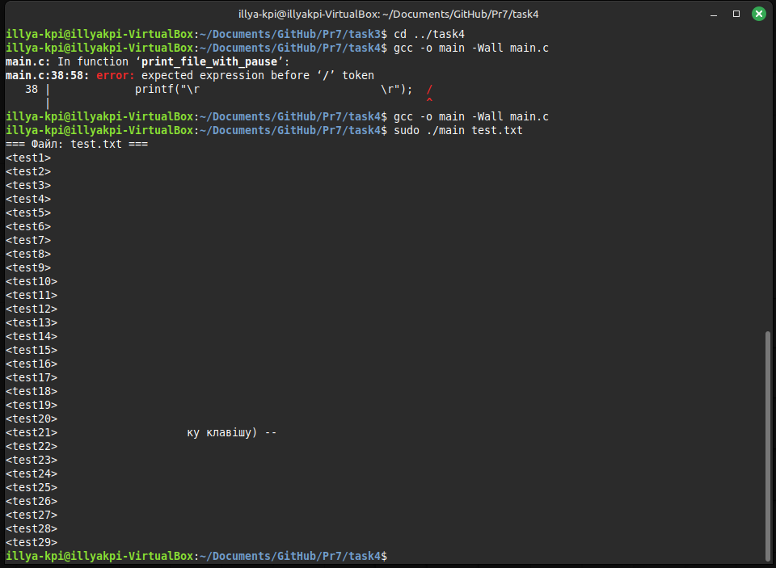
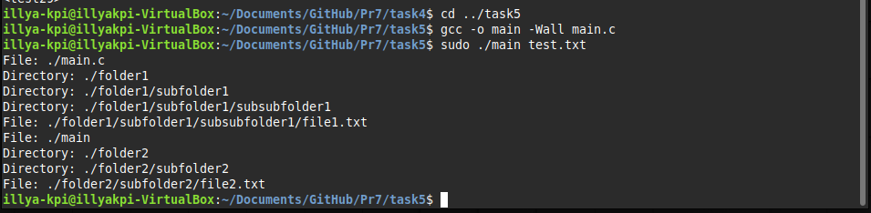
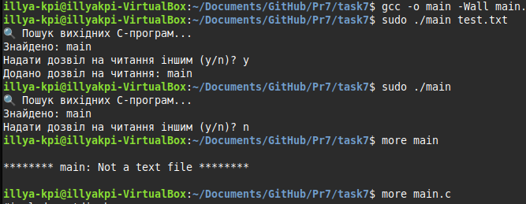
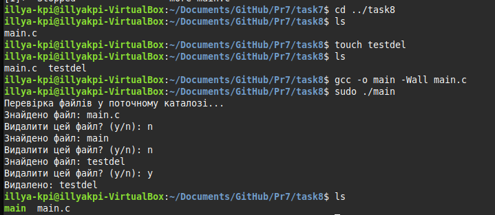
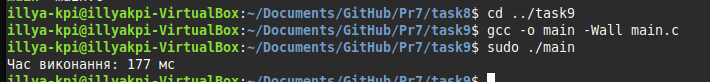
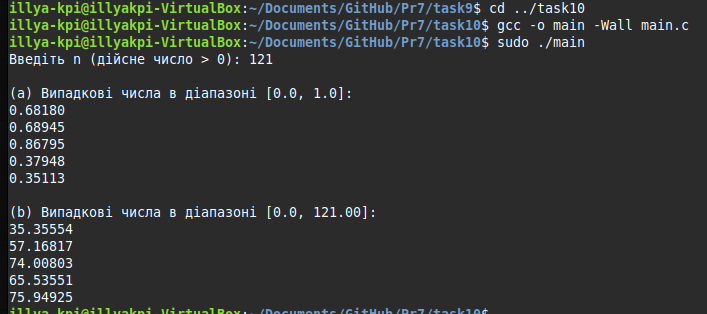
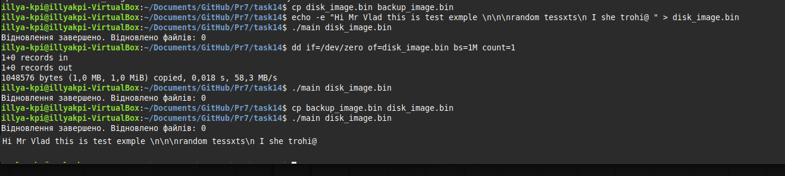

# Практична робота 7

## Завдання 1
**Опис:**
Використання popen для запуску зовнішньої команди та читання її виводу.

**Програмна реалізація:**
Запускається команда через popen, вивід зчитується та виводиться на екран.

- [Код до завдання](task1/main.c)
- 

### Результат роботи

програма виведе результат виконання зовнішньої команди (наприклад, список користувачів або процесів) та статус завершення.

---
## Завдання 2
**Опис:**
Виведення детальної інформації про файли у каталозі (аналог ls -l).

**Програмна реалізація:**
Використовуються функції stat, getpwuid, getgrgid для отримання прав, власника, групи, розміру та часу модифікації файлів.

- [Код до завдання](task2/main.c)
- 

### Результат роботи

програма виведе список файлів у поточній директорії з детальною інформацією про кожен файл (права, власник, група, розмір, дата, ім'я).

---
## Завдання 3
**Опис:**
Пошук і виведення рядків, що містять задане слово у файлі.

**Програмна реалізація:**
Зчитується файл построково, кожен рядок перевіряється на наявність підрядка.

- [Код до завдання](task3/main.c)
- 

### Результат роботи

програма виведе всі рядки з файлу, які містять задане слово.

---
## Завдання 4
**Опис:**
Посторінковий вивід вмісту файлів з паузою після кожних 20 рядків.

**Програмна реалізація:**
Використовується getch для очікування натискання клавіші, вивід зупиняється після кожних 20 рядків.

- [Код до завдання](task4/main.c)
- 

### Результат роботи

програма виведе вміст файлу порціями по 20 рядків, зупиняючись для підтвердження користувача.

---
## Завдання 5
**Опис:**
Рекурсивний обхід директорій та вивід імен файлів і папок.

**Програмна реалізація:**
Використовується рекурсія для обходу всіх вкладених папок і виводу їх вмісту.

- [Код до завдання](task5/main.c)
- 

### Результат роботи

програма виведе імена всіх файлів і папок у поточній директорії та піддиректоріях.

---
## Завдання 6
**Опис:**
Вивід підкаталогів поточної директорії в алфавітному порядку.

**Програмна реалізація:**
Зчитуються всі підкаталоги, сортуються та виводяться на екран.

- [Код до завдання](task6/main.c)
- 

### Результат роботи

програма виведе список підкаталогів у поточній директорії, відсортований за алфавітом.

---
## Завдання 7
**Опис:**
Пошук виконуваних файлів у директорії та додавання прав на читання.

**Програмна реалізація:**
Використовується stat для перевірки прав, chmod для зміни прав доступу.

- [Код до завдання](task7/main.c)
- 

### Результат роботи

програма знайде всі виконувані файли у директорії, запропонує надати їм права на читання, і виведе результат зміни прав.

---
## Завдання 8
**Опис:**
Видалення файлів у поточній директорії з підтвердженням.

**Програмна реалізація:**
Використовується remove для видалення, користувач підтверджує кожне видалення.

- [Код до завдання](task8/main.c)
- 

### Результат роботи

програма виведе список файлів, запитає підтвердження на видалення кожного, і повідомить про успішне видалення.

---
## Завдання 9
**Опис:**
Вимірювання часу виконання циклу.

**Програмна реалізація:**
Використовується gettimeofday для вимірювання часу до і після циклу.

- [Код до завдання](task9/main.c)
- 

### Результат роботи

програма виведе час виконання циклу у мілісекундах.

---
## Завдання 10
**Опис:**
Генерація випадкових чисел у заданому діапазоні.

**Програмна реалізація:**
Використовується rand для генерації чисел у [0,1] та [0,n].

- [Код до завдання](task10/main.c)
- 

### Результат роботи

програма виведе кілька випадкових чисел у заданих діапазонах.

---
## Завдання 14
**Опис:**
Відновлення текстових файлів із блочного дампу.

**Програмна реалізація:**
Зчитуються блоки з файлу, якщо блок містить текст — створюється новий файл.

- [Код до завдання](task14/main.c)
- 

### Результат роботи

програма створить один або кілька текстових файлів із дампу, виведе повідомлення про відновлення та кількість відновлених файлів. 