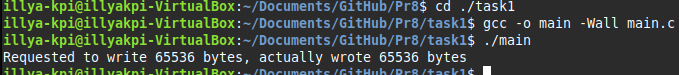
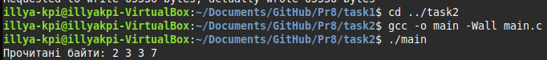
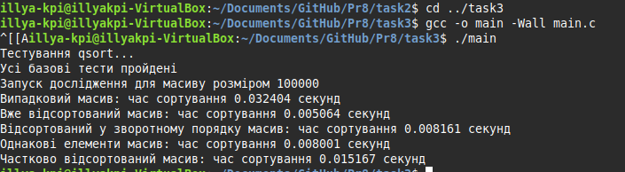
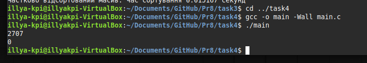
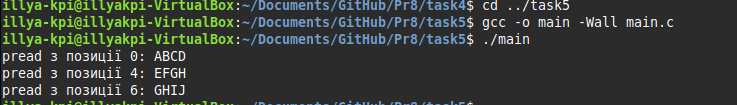

# Практична робота 8

## Завдання 1
**Опис:**
 Чи може виклик count = write(fd, buffer, nbytes); повернути в змінній count значення, відмінне від nbytes? Якщо так, то чому? Наведіть робочий приклад програми, яка демонструє вашу відповідь.

**Як працює:**
Програма створює pipe або файл, намагається записати великий буфер через write(). Вона перевіряє, чи повертає write() кількість записаних байтів, меншу за nbytes, і пояснює, чому це можливо (наприклад, через обмеження буфера ядра або неблокуючий режим). Виводиться фактична кількість записаних байтів та пояснення.

- [Код до завдання](task1/main.c)
- 

### Результат роботи

Виводиться кількість реально записаних байтів та пояснення, чому write() може повернути значення, менше за nbytes.

---
## Завдання 2
**Опис:**
Є файл, дескриптор якого - fd. Файл містить таку послідовність байтів: 4, 5, 2, 2, 3, 3, 7, 9, 1, 5. У програмі виконується наступна послідовність системних викликів:
lseek(fd, 3, SEEK_SET);
read(fd, &buffer, 4);
де виклик lseek переміщує покажчик на третій байт файлу. Що буде містити буфер після завершення виклику read? Наведіть робочий приклад програми, яка демонструє вашу відповідь.

**Як працює:**
Програма створює файл з вказаною послідовністю байтів, виконує lseek() для переміщення покажчика, потім read() для зчитування 4 байтів у буфер. Виводить вміст буфера після читання та пояснює, які саме байти були зчитані.

- [Код до завдання](task2/main.c)
- 

### Результат роботи

Виводиться вміст буфера після read() та пояснення, які байти були зчитані з файлу, а саме прочиталися індекси 3-7, тобто згідно викликів lseek до 3, і прочитати 4.

---
## Завдання 3
**Опис:**
Бібліотечна функція qsort призначена для сортування даних будь-якого типу. Для її роботи необхідно підготувати функцію порівняння, яка викликається з qsort кожного разу, коли потрібно порівняти два значення.
Оскільки значення можуть мати будь-який тип, у функцію порівняння передаються два вказівники типу void* на елементи, що порівнюються.
Напишіть програму, яка досліджує, які вхідні дані є найгіршими для алгоритму швидкого сортування. Спробуйте знайти кілька масивів даних, які змушують qsort працювати якнайповільніше. Автоматизуйте процес експериментування так, щоб підбір і аналіз вхідних даних виконувалися самостійно.

Придумайте і реалізуйте набір тестів для перевірки правильності функції qsort.

**Як працює:**
Програма реалізує функцію порівняння для qsort, генерує різні масиви (включаючи ті, що можуть бути найгіршими для швидкого сортування), автоматично вимірює час сортування для кожного з них, аналізує результати та виводить, які масиви є найгіршими. Також запускаються тести для перевірки правильності сортування.

- [Код до завдання](task3/main.c)
- 

### Результат роботи

Виводиться час сортування для різних масивів, результати тестів та аналіз найгірших випадків для qsort.

---
## Завдання 4
**Опис:**
 Виконайте наступну програму на мові програмування С:
```c
int main() {
  int pid;
  pid = fork();
  printf("%d\n", pid);
}
```
Завершіть цю програму. Припускаючи, що виклик fork() був успішним, яким може бути результат виконання цієї програми?

**Як працює:**
Програма викликає fork(), після чого у батьківському процесі pid містить PID дочірнього процесу, а у дочірньому - 0. В обох процесах виконується printf, тому на екран виводиться два значення: 0 (від дочірнього) і PID дочірнього процесу (від батьківського). Програма завершується для обох процесів.

- [Код до завдання](task4/main.c)
- 

### Результат роботи

На екрані з'являються два числа: 0 та PID дочірнього процесу. Це демонструє розгалуження виконання після fork().

---
## Завдання 14
**Опис:**
Створіть програму, яка досліджує ефект різних позицій у файлі при читанні через pread().

**Як працює:**
Програма створює файл, записує у нього дані, потім за допомогою pread() читає різні ділянки файлу з різних позицій, не змінюючи позицію файлового дескриптора. Виводить прочитані фрагменти та аналізує, як змінюється результат залежно від позиції читання.

- [Код до завдання](task14/main.c)
- 

### Результат роботи

Виводяться фрагменти файлу, прочитані з різних позицій, та пояснення ефекту використання pread(). 