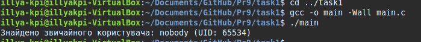
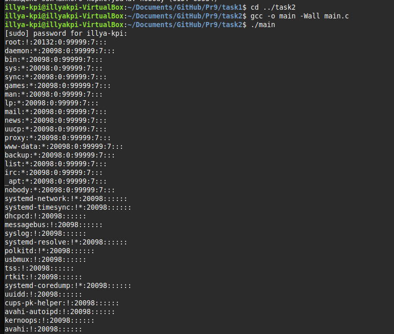
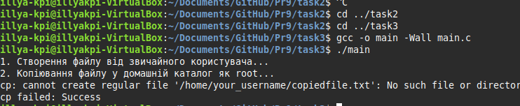
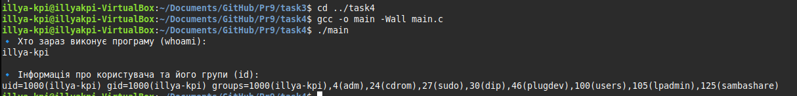
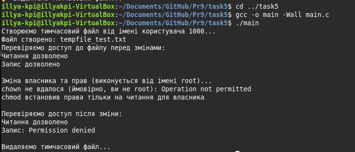
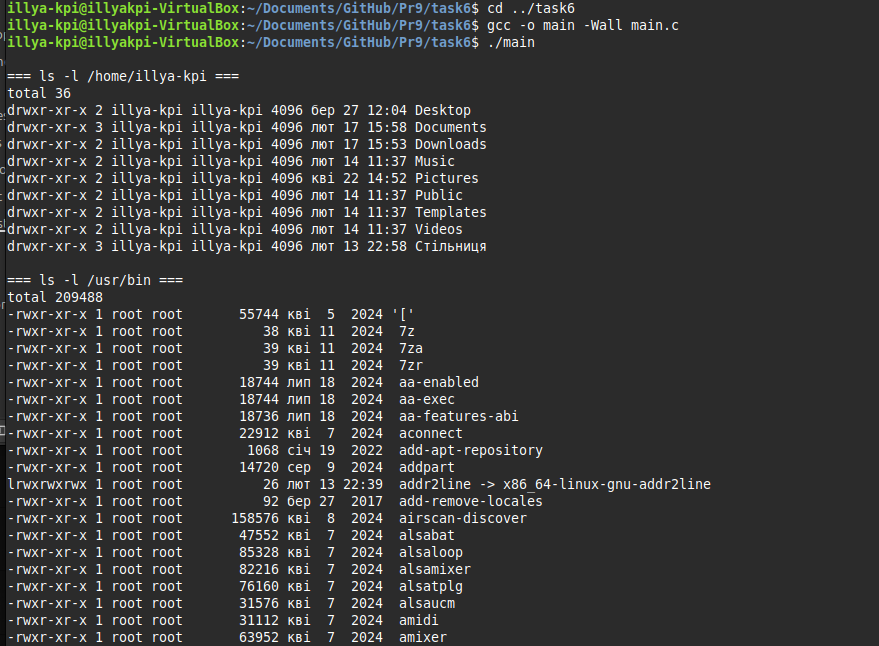
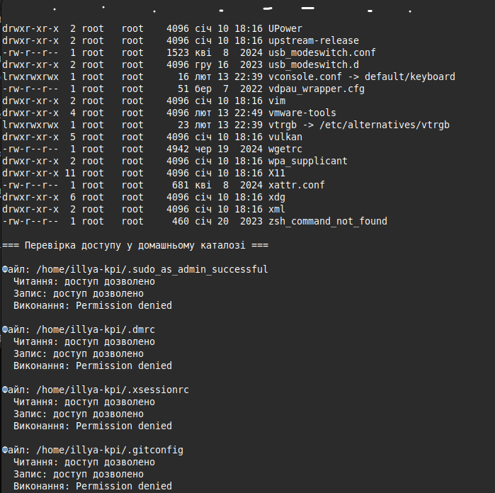
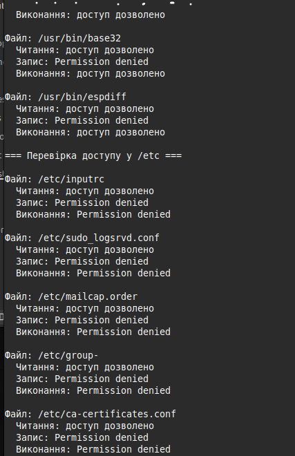
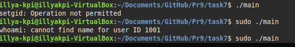

# Практична робота 9

## Завдання 1
**Опис:**
Напишіть програму, яка читає файл /etc/passwd за допомогою команди getent passwd, щоб дізнатись, які облікові записи визначені на вашому комп'ютері.
Програма повинна визначити, чи є серед них звичайні користувачі (ідентифікатори UID повинні бути більші за 500 або 1000, залежно від вашого дистрибутива), окрім вас.

**Як працює:**
Програма викликає getent passwd через popen(), зчитує всі рядки, розбиває їх на поля, аналізує UID кожного користувача. Якщо UID відповідає критерію звичайного користувача і це не поточний користувач, ім'я виводиться на екран. В кінці програма повідомляє, якщо таких користувачів не знайдено.

- [Код до завдання](task1/main.c)
- 

### Результат роботи

Виводиться список звичайних користувачів (UID > 500 або 1000), окрім поточного, або повідомлення, що таких немає.

---
## Завдання 2
**Опис:**
Напишіть програму, яка виконує команду cat /etc/shadow від імені адміністратора, хоча запускається від звичайного користувача.
(Ваша програма повинна робити необхідне, виходячи з того, що конфігурація системи дозволяє отримувати адміністративний доступ за допомогою відповідної команди.)

**Як працює:**
Програма через popen() викликає команду з правами root (наприклад, через sudo), намагається зчитати вміст /etc/shadow. Якщо доступ дозволено, вміст виводиться на екран, інакше — повідомлення про помилку доступу.

- [Код до завдання](task2/main.c)
- 

### Результат роботи

Виводиться вміст /etc/shadow або повідомлення про відмову у доступі.

---
## Завдання 3
**Опис:**
Напишіть програму, яка від імені root копіює файл, який вона перед цим створила від імені звичайного користувача. Потім вона повинна помістити копію у домашній каталог звичайного користувача.
Далі, використовуючи звичайний обліковий запис, програма намагається змінити файл і зберегти зміни. Що відбудеться?
Після цього програма намагається видалити цей файл за допомогою команди rm. Що відбудеться?

**Як працює:**
Програма створює файл від імені звичайного користувача, потім через root-обліковий запис копіює його у домашній каталог користувача. Далі, під звичайним користувачем, намагається змінити та видалити файл, фіксує результат кожної операції та пояснює, чому це можливо або ні (залежно від прав).

- [Код до завдання](task3/main.c)
- 

### Результат роботи

Виводяться повідомлення про успішність або помилки при зміні та видаленні файлу, з поясненням причин.

---
## Завдання 4
**Опис:**
Напишіть програму, яка по черзі виконує команди whoami та id, щоб перевірити стан облікового запису користувача, від імені якого вона запущена.
Є ймовірність, що команда id виведе список різних груп, до яких ви належите. Програма повинна це продемонструвати.

**Як працює:**
Програма через system() викликає whoami та id, виводить ім'я поточного користувача та список груп, до яких він належить. Це дозволяє побачити, під яким обліковим записом і з якими правами виконується програма.

- [Код до завдання](task4/main.c)
- 

### Результат роботи

Виводиться ім'я користувача та перелік груп, до яких він належить.

---
## Завдання 5
**Опис:**
Напишіть програму, яка створює тимчасовий файл від імені звичайного користувача. Потім від імені суперкористувача використовує команди chown і chmod, щоб змінити тип володіння та права доступу.
Програма повинна визначити, в яких випадках вона може виконувати читання та запис файлу, використовуючи свій обліковий запис.

**Як працює:**
Програма створює файл, змінює його власника та права через chown і chmod, потім під звичайним користувачем намагається читати і записувати у файл. Виводить повідомлення про успішність або помилки кожної операції, пояснює, чому доступ дозволено чи заборонено.

- [Код до завдання](task5/main.c)
- 

### Результат роботи

Виводяться результати спроб читання і запису файлу під різними правами, з поясненням.

---
## Завдання 6
**Опис:**
Напишіть програму, яка виконує команду ls -l, щоб переглянути власника і права доступу до файлів у своєму домашньому каталозі, в /usr/bin та в /etc.
Продемонструйте, як ваша програма намагається обійти різні власники та права доступу користувачів, а також здійснює спроби читання, запису та виконання цих файлів.

**Як працює:**
Програма через fork+exec викликає ls -l для кожної директорії, аналізує права доступу до файлів, намагається виконати операції читання, запису, виконання для різних файлів, фіксує результат і пояснює, чому доступ дозволено чи заборонено.

- [Код до завдання](task6/main.c)
- 
- 
- 

### Результат роботи

Виводиться інформація про права доступу до файлів у різних директоріях та результати спроб доступу.

---
## Завдання 14
**Опис:**
Змоделюйте, як cron виконує команду з правами іншого користувача. Коли це не спрацює?

**Як працює:**
Програма змінює UID та GID процесу через setuid() і setgid(), після чого викликає команду whoami для перевірки, під яким користувачем виконується процес. Виводить результат зміни прав і пояснює, у яких випадках cron або інший планувальник не зможе виконати команду з правами іншого користувача (наприклад, через обмеження системи чи відсутність прав).

- [Код до завдання](task14/main.c)
- 

### Результат роботи

Виводиться результат виконання команди з новими UID/GID та пояснення, коли зміна прав не спрацює. 